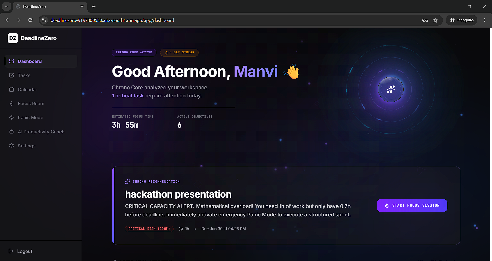
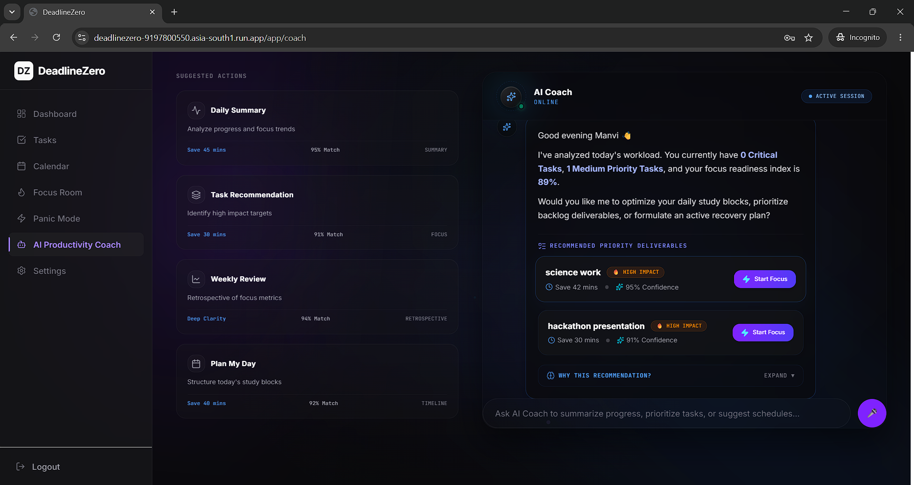
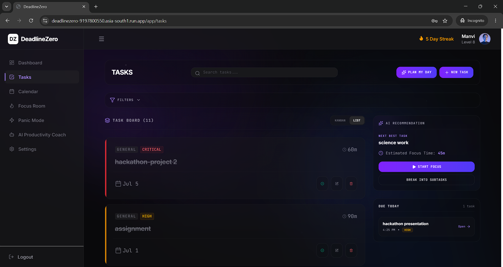

<div align="center">

# DeadlineZero

### Turning deadline panic into intelligent execution — powered by Google Gemini.

[](https://deadlinezero-9197800550.asia-south1.run.app)
[](https://ai.google.dev)
[](https://aistudio.google.com)
[](https://firebase.google.com)
[](https://cloud.google.com/run)

**Built for the Google Hackathon — "The Last-Minute Life Saver" track**

**[🌐 Try the Live App](https://deadlinezero-9197800550.asia-south1.run.app)** &nbsp;·&nbsp; **[📂 GitHub Repo](#)** &nbsp;·&nbsp; **[🎥 Demo Video](<a href="https://youtu.be/Qgg8KPE-ylc" target="_blank">
  
</a>)**

</div>

<br>

<!--
  📸 ADD SCREENSHOTS / DEMO GIF HERE — this is the single highest-impact section for judges.
  Recommended: 1 hero GIF (15-20s) showing AI Coach + Task Breakdown in action,
  or 3 screenshots: Dashboard | AI Coach | Voice Task Parsing
-->
<div align="center">
  <table>
    <tr>
     <td></td>
<td></td>
<td></td>
    </tr>
    <tr>
      <td align="center"><sub>Dashboard</sub></td>
      <td align="center"><sub>AI Coach</sub></td>
      <td align="center"><sub>Voice Task Parsing</sub></td>
    </tr>
  </table>
</div>

---

## The Problem

Students, professionals, and entrepreneurs constantly miss deadlines — not because they lack tools, but because existing task managers only **store** tasks. They send passive reminders that are easy to ignore and offer zero help when someone is actually overwhelmed and out of time.

## The Solution

**DeadlineZero is an AI productivity coach, not a to-do list.** It uses **Google Gemini** to actively analyze your workload, tell you what to do *right now*, and break down anything too big to start — turning last-minute panic into a clear, executable plan.

---

## ⭐ What Makes This Different

> **It doesn't just remind you. It thinks with you.**

| Traditional To-Do App | DeadlineZero |
|---|---|
| Static reminder at a fixed time | AI continuously re-assesses risk as your workload changes |
| You manually prioritize | Gemini ranks tasks by urgency + effort + deadline pressure |
| Big tasks sit untouched | Gemini auto-splits them into actionable subtasks |
| Typing required to log tasks | Speak naturally — AI extracts the full structured task |

---

## ✨ Core Features

### 🤖 AI Productivity Coach — *the heart of DeadlineZero*
Real-time Gemini-powered analysis of your entire workload: deadline risk scoring, daily planning, focus-session suggestions, and priority re-ranking as things change throughout the day.

### ✂️ AI Task Breakdown
Drop in a big, vague task ("finish thesis chapter") and Gemini returns a time-boxed sequence of concrete subtasks — the difference between procrastinating and starting.

### 🎙️ Voice Task Parsing
Speak a task naturally. Gemini extracts title, priority, deadline, estimated duration, and category — no forms, no friction.

### 📋 Smart Task Management
Full CRUD task management with categories, priorities, deadlines, and progress tracking.

### 📊 Dashboard & 📅 Calendar
At-a-glance productivity metrics, completion stats, deadline risk visualization, and a calendar view for visual scheduling.

### 🔐 Authentication
Firebase-backed email/password and Google Sign-In with secure session management.

---

## 🧪 Built With Google AI Studio

This project's development workflow itself was powered by **[Google AI Studio](https://aistudio.google.com)** — used extensively for prompt design, prototyping AI behaviors, and iterating on Gemini integrations before wiring them into the application.

- **Prompt engineering & testing**: AI Studio was used to design and refine the prompts behind the AI Coach, task breakdown, and voice parsing features — testing different prompt structures against real task data to get consistent, structured Gemini outputs.
- **Rapid iteration**: Features were prototyped directly in AI Studio's playground to validate behavior (e.g., subtask quality, risk-scoring logic) before integrating the finalized prompts into the Express backend.
- **Model behavior tuning**: Response formatting, schema consistency, and edge-case handling for Gemini outputs were iterated on in AI Studio to ensure reliable JSON structures the frontend could consume directly.

Using AI Studio as the development environment for the AI layer meant the prompts powering DeadlineZero's core intelligence were tested and validated *before* becoming part of the production codebase — directly aligned with the hackathon's emphasis on building with Google's AI tooling end-to-end.

---

## 🛠 How We Used Gemini

DeadlineZero doesn't just call the Gemini API for generic text — it's the decision-making core of the app:

- **Risk scoring**: Gemini is fed each task's deadline, estimated effort, and current workload to output a prioritized, risk-ranked list — not a simple "sort by due date."
- **Subtask generation**: structured prompts ask Gemini to decompose tasks into time-boxed, actionable steps rather than vague suggestions.
- **Voice-to-structured-task**: free-form speech is parsed into a strict schema (title, priority, deadline, duration, category) so it slots directly into the task system with no manual cleanup.

---

## 🧰 Tech Stack

| Layer | Technology |
|---|---|
| Frontend | React 19, TypeScript, Vite, Tailwind CSS, Zustand, React Router |
| Backend | Node.js, Express.js |
| Database | Cloud Firestore |
| Authentication | Firebase Authentication |
| AI | Google Gemini API |
| Deployment | Google Cloud Run |

---

## ☁️ Google Technologies Used

| Technology | Role |
|---|---|
| **Google Gemini API** | AI coaching, task breakdown, voice parsing, risk-based prioritization |
| **Google AI Studio** | Prompt design, prototyping, and testing for all Gemini-powered features |
| **Firebase Authentication** | Secure email/password and Google Sign-In |
| **Cloud Firestore** | Real-time database for tasks, profiles, productivity data |
| **Google Cloud Run** | Auto-scaling, containerized production hosting |

---

## 🏗 Architecture

```
React 19 + TypeScript  (Frontend)
            │
            ▼
   Node.js + Express.js  (Backend API)
            │
   ┌────────┴────────┐
   ▼                 ▼
Gemini API     Cloud Firestore
(AI Engine)    (Real-time Data)
   │                 │
   └────────┬────────┘
            ▼
 Firebase Authentication
            │
            ▼
      Google Cloud Run
      (Production Host)
```

---

## 🔮 What's Next

- [ ] Google Calendar synchronization
- [ ] Fully autonomous AI scheduling
- [ ] Team collaboration & shared deadlines
- [ ] Native mobile app (iOS/Android)
- [ ] Predictive deadline forecasting from historical patterns
- [ ] AI-generated study/project plans

---

<details>
<summary><strong>🚀 Run It Locally</strong> (click to expand)</summary>

<br>

**Prerequisites:** Node.js 18+, a [Gemini API key](https://ai.google.dev), a [Firebase project](https://console.firebase.google.com)

```bash
# Clone
git clone <repository-url>
cd deadlinezero

# Install
npm install

# Configure environment
# Create a .env file:
GEMINI_API_KEY=your_gemini_api_key
VITE_FIREBASE_API_KEY=your_firebase_api_key
VITE_FIREBASE_AUTH_DOMAIN=your_project.firebaseapp.com
VITE_FIREBASE_PROJECT_ID=your_project_id
VITE_FIREBASE_STORAGE_BUCKET=your_project.appspot.com
VITE_FIREBASE_MESSAGING_SENDER_ID=your_sender_id
VITE_FIREBASE_APP_ID=your_app_id

# Run dev server
npm run dev

# Production build
npm run build
npm start
```

**Project structure:**
```
src/
├── client/
│   ├── features/      # Task, Coach, Calendar, Dashboard modules
│   ├── components/    # Shared UI components
│   ├── store/         # Zustand state stores
│   ├── services/      # API + Firebase service layer
│   └── utils/
├── server.ts
└── vite.config.ts
```

</details>

---

## 👩‍💻 Author

**Mahak Seth** — B.Tech CSE Student · Aspiring AI & Full Stack Developer

## 🙏 Acknowledgements

[Google Gemini API](https://ai.google.dev) · [Google AI Studio](https://aistudio.google.com) · [Google Cloud Run](https://cloud.google.com/run) · [Firebase](https://firebase.google.com) · [React](https://react.dev) · [Vite](https://vitejs.dev) · [Tailwind CSS](https://tailwindcss.com)

---

<div align="center">

⭐ **If you like this project, consider giving it a star!**

**[⬆ Back to Top](#deadlinezero)**

</div>
